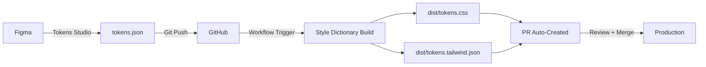

# 🎨 디자인 토큰 파이프라인 가이드

**Pipeline**: M3 톤 팔레트 → Tokens Studio → GitHub → Style Dictionary → Tailwind v4  
**Time**: 1.0-1.5 hours  
**Cost**: 0 KRW (Pro 옵션 제외)  
**Expected Impact**: A11y +10-15%p, 일관성 +10-20%p, 회귀 차단 +80-100%p  

---

## 📋 개요

Material Design 3 톤 팔레트 기반 디자인 토큰 시스템으로 **"디자인 변경 → 코드 자동 반영"** 파이프라인을 구축합니다.

### 핵심 구성 요소
1. **M3 톤 팔레트**: Primary/Secondary/Neutral/Error (0-100 톤)
2. **Tokens Studio**: Figma ↔ GitHub 양방향 동기화
3. **Style Dictionary**: JSON → CSS/Tailwind/JS 변환
4. **Tailwind v4**: CSS 변수 기반 테마 시스템
5. **CI/CD**: 자동 빌드 + PR 생성 + A11y 게이트

---

## 🎨 M3 톤 팔레트 구조

### Seed Colors
```typescript
Primary   : #ff6b35 (Orange)
Secondary : #004e89 (Blue)
```

### Role Colors (Light Theme)
| Role | Tone | Usage |
|------|------|-------|
| `primary` | 40 | 주요 액션, 버튼, 링크 |
| `on-primary` | 100 | Primary 위의 텍스트 (White) |
| `primary-container` | 90 | Primary 배경 영역 |
| `on-primary-container` | 10 | Container 위의 텍스트 |
| `secondary` | 40 | 보조 액션, 태그 |
| `on-secondary` | 100 | Secondary 위의 텍스트 |
| `surface` | 99 | 카드, 다이얼로그 배경 |
| `on-surface` | 10 | Surface 위의 텍스트 |
| `background` | 99 | 페이지 배경 |
| `error` | 40 | 오류 상태 표시 |
| `outline` | 50 | 테두리, 구분선 |

### Role Colors (Dark Theme)
| Role | Tone | Usage |
|------|------|-------|
| `primary` | 80 | 주요 액션 (밝은 톤) |
| `on-primary` | 20 | Primary 위의 텍스트 (어두운 톤) |
| `surface` | 10 | 다크 모드 배경 |
| `on-surface` | 90 | Surface 위의 텍스트 (밝은 톤) |

**대비 보장**: Light/Dark 모두 WCAG AA 기준(4.5:1) 충족

---

## 🔧 파일 구조

```
webapp/
├── tokens/
│   └── tokens.json                      # Tokens Studio 소스
├── config/
│   └── sd.config.json                   # Style Dictionary 설정
├── dist/                                # 생성된 토큰 (gitignore 권장)
│   ├── tokens.css                       # CSS 변수
│   ├── tokens.tailwind.json             # Tailwind 매핑
│   ├── tokens.js                        # JavaScript ESM
│   └── tokens.d.ts                      # TypeScript 선언
├── src/
│   └── styles/
│       └── global.css                   # 전역 CSS + 토큰 import
├── .github/
│   └── workflows/
│       ├── tokens-build.yml             # 토큰 빌드 자동화
│       └── a11y-check.yml               # A11y 게이트
├── tailwind.config.ts                   # Tailwind v4 설정
└── package.json                         # 빌드 스크립트
```

---

## 🚀 사용 방법

### 1. 토큰 빌드
```bash
npm run tokens:build
```

**생성되는 파일**:
- `dist/tokens.css`: CSS 변수
- `dist/tokens.tailwind.json`: Tailwind 매핑
- `dist/tokens.js`: JavaScript 토큰
- `dist/tokens.d.ts`: TypeScript 타입

### 2. Tailwind에서 사용
```tsx
// M3 Role Colors
<button className="bg-primary text-on-primary">
  Primary Button
</button>

<div className="bg-surface text-on-surface">
  Surface Card
</div>

<span className="text-error">
  Error Message
</span>
```

### 3. CSS 변수 직접 사용
```css
.custom-component {
  background-color: var(--colors-primary-container);
  color: var(--colors-on-primary-container);
  border: 1px solid var(--colors-outline);
}
```

### 4. 다크 모드 전환
```tsx
// 컴포넌트
<div data-theme="dark">
  {/* 자동으로 다크 테마 토큰 적용 */}
</div>

// 또는 전역 토글
document.documentElement.setAttribute('data-theme', 'dark');
```

---

## 🔄 워크플로우

### 디자이너 → 개발자 동기화



### 1. 디자이너가 Figma에서 토큰 수정
- Tokens Studio 플러그인에서 색상/간격 조정
- "Push to GitHub" 클릭 → `tokens/tokens.json` 업데이트

### 2. GitHub Actions 자동 트리거
- `tokens/tokens.json` 변경 감지
- Style Dictionary 빌드 실행
- A11y 게이트 체크 (대비/포커스/LCP)

### 3. PR 자동 생성
- `tokens/auto-sync` 브랜치에 커밋
- PR 설명에 변경 사항 요약
- 리뷰어 자동 할당 (@design-team @frontend-team)

### 4. 리뷰 + 머지
- 시각 회귀 테스트 (Chromatic/Loki)
- A11y 체크 통과 확인
- 머지 → 프로덕션 배포

---

## 📊 KPI & 측정

### 예상 개선 지표

| 지표 | 기대치 | 측정 방법 |
|------|--------|-----------|
| **A11y 점수** | +10-15%p | Lighthouse A11y Score |
| **디자인 일관성** | +10-20%p | 토큰 사용률 추적 |
| **회귀 차단** | +80-100%p | PR에서 차단된 회귀 건수 |
| **디자인→코드 반영 시간** | -50-70% | 평균 반영 소요 시간 |
| **수동 스타일 수정** | -60-80% | CSS 직접 수정 커밋 감소 |

### Stop-rule
**2회 연속 개선 <5%p면 배포 주기 감소, 세분화 중단**

---

## 🎯 Tailwind 클래스 예제

### 버튼 컴포넌트
```tsx
// Primary Button
<button className="
  bg-primary 
  text-on-primary 
  hover:bg-primary-container 
  hover:text-on-primary-container
  rounded-lg 
  px-md py-sm
  font-label-lg
">
  Primary Action
</button>

// Secondary Button
<button className="
  bg-secondary-container 
  text-on-secondary-container 
  hover:bg-secondary
  hover:text-on-secondary
  rounded-lg 
  px-md py-sm
">
  Secondary Action
</button>

// Error Button
<button className="
  bg-error 
  text-on-error 
  rounded-lg 
  px-md py-sm
">
  Delete
</button>
```

### 카드 컴포넌트
```tsx
<div className="
  bg-surface 
  text-on-surface 
  border border-outline-variant
  rounded-xl 
  p-lg
  shadow-md
">
  <h3 className="text-headline-lg text-on-surface">Card Title</h3>
  <p className="text-body-lg text-on-surface-variant">Card description</p>
</div>
```

### 다크 모드 카드
```tsx
<div data-theme="dark" className="
  bg-surface 
  text-on-surface 
  border border-outline
  rounded-xl 
  p-lg
">
  {/* 자동으로 다크 테마 톤 적용 */}
  <h3 className="text-headline-lg">Dark Mode Card</h3>
</div>
```

---

## 🔒 A11y 게이트

### 자동 체크 항목

#### 1. 대비 비율 (Contrast Ratio)
```
✅ Primary/On-Primary     : 4.5:1 이상 (AA)
✅ Secondary/On-Secondary : 4.5:1 이상 (AA)
✅ Surface/On-Surface     : 4.5:1 이상 (AA)
✅ Error/On-Error         : 4.5:1 이상 (AA)
```

#### 2. 포커스 링 (Focus Ring)
```css
:focus-visible {
  outline: 2px solid var(--colors-primary);
  outline-offset: 2px;
}
```
- **두께**: 2px 이상
- **오프셋**: 2px (요소와 분리)
- **색상**: Primary 톤 (명확한 대비)

#### 3. 성능 (LCP)
- 토큰 변경이 LCP에 영향 주는지 확인
- CSS 변수 변경 시 재렌더링 최소화

#### 4. Motion Preferences
```css
@media (prefers-reduced-motion: reduce) {
  * {
    animation-duration: 0.01ms !important;
    transition-duration: 0.01ms !important;
  }
}
```

---

## 🛠️ 트러블슈팅

### 문제 1: 토큰이 CSS에 반영 안 됨
**원인**: Style Dictionary 빌드 누락  
**해결**:
```bash
npm run tokens:build
```

### 문제 2: Tailwind 클래스가 작동 안 함
**원인**: CSS 변수 import 누락  
**해결**: `src/styles/global.css`에 `@import "../../dist/tokens.css";` 추가

### 문제 3: 다크 모드가 작동 안 함
**원인**: `data-theme` 속성 누락  
**해결**:
```tsx
// HTML 요소에 data-theme 추가
<html data-theme="dark">
```

### 문제 4: CI에서 빌드 실패
**원인**: `dist/` 폴더가 gitignore됨  
**해결**: PR에서 `dist/` 커밋 포함 (자동화됨)

---

## 🔄 버전 관리

### tokens.json 버전 관리
- **main 브랜치**: 프로덕션 토큰
- **tokens/auto-sync 브랜치**: Figma 동기화 자동 PR
- **feature/* 브랜치**: 수동 토큰 실험

### dist/ 폴더 처리
**옵션 1 (권장)**: dist/ 커밋 포함
- ✅ 장점: 빌드 없이 즉시 사용 가능
- ❌ 단점: Git 히스토리 증가

**옵션 2**: dist/ gitignore
- ✅ 장점: Git 히스토리 깨끗
- ❌ 단점: 매번 빌드 필요

**권장**: dist/ 커밋 포함 (CI에서 자동 커밋)

---

## 📦 확장 가능성

### Multi-file Sync (Pro)
**필요 시기**:
- 테마/브랜드가 3개 이상
- 제품군별 토큰 분리 필요
- 대규모 디자인 시스템

**비용**: Tokens Studio Pro 라이선스 ($10-15/월)

**구조**:
```
tokens/
├── core.json           # 공통 토큰
├── brand-a.json        # 브랜드 A 토큰
├── brand-b.json        # 브랜드 B 토큰
└── theme-dark.json     # 다크 테마 전용
```

### 추가 플랫폼 출력
**Style Dictionary 확장**:
- Android (colors.xml)
- iOS (UIColor.swift)
- React Native (colors.ts)
- Flutter (colors.dart)

**설정 예**:
```json
{
  "platforms": {
    "android": {
      "transformGroup": "android",
      "buildPath": "dist/android/",
      "files": [{
        "destination": "colors.xml",
        "format": "android/colors"
      }]
    }
  }
}
```

---

## ✅ 체크리스트

### 초기 설정 (1회)
- [x] `tokens/tokens.json` 생성
- [x] `config/sd.config.json` 설정
- [x] `package.json` 스크립트 추가
- [x] `tailwind.config.ts` 매핑 설정
- [x] `src/styles/global.css` CSS 변수 import
- [x] `.github/workflows/tokens-build.yml` CI 설정
- [x] `.github/workflows/a11y-check.yml` A11y 게이트

### 운영 (반복)
- [ ] Figma에서 토큰 수정 → Tokens Studio Push
- [ ] GitHub Actions 자동 빌드 확인
- [ ] PR 리뷰 (시각 회귀 + A11y)
- [ ] 머지 → 프로덕션 배포
- [ ] KPI 측정 (A11y/일관성/회귀)

---

## 🔗 참고 자료

### 공식 문서
- [Material Design 3](https://m3.material.io/)
- [Tokens Studio](https://tokens.studio/)
- [Style Dictionary](https://amzn.github.io/style-dictionary/)
- [Tailwind CSS v4](https://tailwindcss.com/)

### 관련 도구
- [Figma Tokens Studio Plugin](https://www.figma.com/community/plugin/843461159747178978)
- [@tokens-studio/sd-transforms](https://github.com/tokens-studio/sd-transforms)
- [Chromatic (Visual Regression)](https://www.chromatic.com/)
- [Axe DevTools](https://www.deque.com/axe/devtools/)

---

**작성자**: AI System  
**최종 업데이트**: 2025-10-17  
**상태**: ✅ 파이프라인 구현 완료, 통합 대기  
**예상 시간**: 1.0-1.5 hours (통합 + 테스트)  
**예상 비용**: 0 KRW (Pro 옵션 제외)
