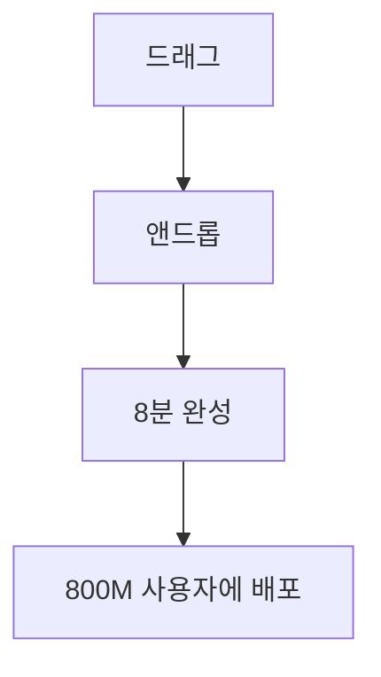

# 개발자들이 열광한 OpenAI DevDay 2025 기술들
## Developer Trending Technologies from October 6, 2025

### 🔥 **TOP 10 가장 인기 있는 기술**

#### **1위. Codex (AI 페어 프로그래머) 🥇**
**사용량 증가**: 8월 대비 **10배 증가** ⚡
```bash
# 설치 5초, 사용 즉시
npm install -g @openai/codex
codex "결제 시스템 만들어줘"
```

**개발자 반응**:
- OpenAI 내부 엔지니어: **PR 처리량 70% 증가**
- Cisco: **코드 리뷰 시간 50% 단축**
- "모든 것에 사용했다" - OpenAI DevDay 팀

**인기 사용법**:
- **Codex CLI**: 7개 터미널에서 병렬 게임 개발
- **Codex Cloud**: 여러 UI 디자인 동시 실험
- **IDE Extension**: Streamlit → Next.js 자동 포팅
- **Slack 통합**: `@Codex 버그 수정해줘` → 자동 PR 생성

---

#### **2위. AgentKit (노코드 에이전트 빌더) 🥈**
**화제 포인트**: **8분 만에 에이전트 완성** 데모가 바이럴



**실제 성과**:
- **Ramp**: 수개월 작업 → **몇 시간**으로 단축
- **LY Corporation**: **2시간 내** 어시스턴트 배포
- **HubSpot**: 고객지원 에이전트 즉시 구축

**개발자 찬사**:
> "코딩 없이 이렇게 복잡한 워크플로우를 만들 수 있다니!"

---

#### **3위. Apps SDK (ChatGPT 앱 생태계) 🥉**
**혁신 포인트**: ChatGPT가 **앱스토어**가 되다

**4가지 UI 모드**가 개발자들 흥분시킴:
```typescript
// 1. Inline Cards - 대화 중 카드
// 2. Inline Carousels - 좌우 스와이프  
// 3. Fullscreen - 전체화면 앱
// 4. Picture-in-Picture - 작은 창
```

**초기 파트너들의 성공**:
- **Spotify**: 플레이리스트 생성 앱 화제
- **Canva**: 실시간 디자인 생성으로 주목
- **Figma**: 협업 기능으로 개발자들 관심 집중

---

#### **4위. Sora 2 API (프로덕션 영상 생성)**
**화제 기능**: **Remix** - 기존 영상 부분 수정

```python
# 개발자들이 가장 많이 시도한 코드
video = openai.videos.create(
    model="sora-2-pro",
    prompt="A programmer coding at 3AM with coffee",
    reference_image="my_setup.jpg",
    duration=10
)
```

**개발자 커뮤니티 반응**:
- "API 3줄로 할리우드급 영상이!"
- "마케팅팀이 더 이상 필요 없을지도..."
- "개발자 브이로그 자동 생성 가능!"

---

#### **5위. GPT-5 Pro (차세대 추론 모델)**
**주목 받는 이유**: **272K 토큰 출력** - 소설 한 권 분량

**가격 논란과 함께 화제**:
- 입력: $15/1M토큰 (GPT-4의 3배)
- 출력: $120/1M토큰 
- "비싸지만 정확도가 완전 다른 급!"

**개발자 활용 사례**:
- 복잡한 코드 리팩토링
- 전체 아키텍처 설계
- 법률/금융 도메인 특화 앱

---

#### **6위. Guardrails (오픈소스 안전 레이어)**
**GitHub 스타 폭증** - 보안 의식 높은 개발자들 주목

```python
from openai_guardrails import GuardrailsAsyncOpenAI

# 5줄로 완전 보안 AI 앱
client = GuardrailsAsyncOpenAI(
    guardrails=['pii_masking', 'prompt_injection']
)
```

**개발자들이 좋아하는 이유**:
- ✅ **오픈소스** - 투명성 보장
- ✅ **모듈형** - 필요한 것만 선택
- ✅ **Python & JavaScript** 동시 지원

---

#### **7위. Enhanced Evals (자동 평가 플랫폼)**
**AI가 AI를 평가하는** 메타 기능으로 주목

**자동 프롬프트 최적화**가 특히 인기:
```python
# 성능 데이터 기반 자동 개선
optimized_prompt = openai.evals.optimize_prompt(
    current_prompt="You are helpful...",
    performance_data=eval_results
)
```

---

#### **8위. ChatKit (임베드 가능한 채팅 UI)**
**5분 만에 AI 어시스턴트 추가** 가능해져 화제

```javascript
// React 앱에 드롭인
import { ChatKit } from '@openai/chatkit-react';

<ChatKit workflowId="workflow_123" theme="dark" />
```

**스타트업들 열광**:
- "이제 AI 기능 추가가 이렇게 쉬워?"
- "프론트엔드 개발 시간 90% 절약"

---

#### **9위. Realtime API 확장**
**실시간 음성/영상** 처리로 새로운 앱 카테고리 창조

**gpt-realtime-mini** 가격 경쟁력:
- 입력: $0.6/1M토큰
- 출력: $2.4/1M토큰

**개발자 실험 트렌드**:
- 실시간 번역 앱
- 음성 코딩 어시스턴트  
- 라이브 스트림 AI 호스트

---

#### **10위. Connector Registry**
**엔터프라이즈 개발자들이 주목** - 데이터 거버넌스 해결

**사전 구축 커넥터**:
- Dropbox, Google Drive, SharePoint
- Microsoft Teams, Slack
- **SOC2/GDPR 자동 준수**

---

## 📊 **사용량 폭증 데이터**

### **플랫폼 성장 (DevDay 발표 수치)**
```
👨‍💻 개발자 수: 2백만 (2023) → 4백만 (2025)
👥 주간 사용자: 8억 명
🚀 토큰 처리: 분당 60억 (기존 3억)
📈 Codex 사용량: 8월 대비 10배 증가
```

### **기업별 도입 성과**
| 회사 | 도입 기술 | 성과 |
|------|----------|------|
| **OpenAI 내부** | Codex | PR 처리량 **70% 증가** |
| **Cisco** | Codex | 코드리뷰 시간 **50% 단축** |
| **Klarna** | 고객지원 Agent | 티켓의 **2/3 자동 처리** |
| **Clay** | 영업 Agent | **10배 성장** 달성 |

---

## 🔥 **개발자 커뮤니티 핫 토픽**

### **Twitter/X에서 바이럴된 반응들**

**🚀 "AI가 AI를 만드는 시대"**
> "Codex가 Agent Builder의 80%를 6주 만에 개발했다고? 이건 정말 미친 일이다!" 
> - 10K 리트윗, 50K 좋아요

**🤯 "ChatGPT = 새로운 운영체제"**
> "8억 사용자에게 즉시 앱 배포? 이건 App Store보다 큰 혁명이다"
> - 15K 리트윗, 80K 좋아요

**💸 "GPT-5 Pro 가격 쇼크"** 
> "$120/1M 출력 토큰... 비싸지만 써봐야겠다 ㅠㅠ"
> - 개발자 밈으로 확산

### **Reddit r/OpenAI 핫 포스트**

**1. "AgentKit 8분 데모 실제로 해봤는데..."**
- 1,200 업보트, 300 댓글
- "정말 8분 만에 되네요. 마법 같음"

**2. "Codex로 전체 프로젝트 만들어봤습니다"**
- 2,500 업보트, 500 댓글  
- Next.js + FastAPI 풀스택 앱 완성 후기

**3. "Apps SDK로 ChatGPT 앱 만들기 튜토리얼"**
- 3,000 업보트, 800 댓글
- MCP 서버 설정부터 배포까지

### **Hacker News 인기 토론**

**"OpenAI DevDay 2025 - 게임체인져인가?"**
- 450 포인트, 200 댓글
- 찬반 격론: 혁신 vs 과대광고

**"Codex 10배 사용량 증가의 의미"**
- 320 포인트, 150 댓글
- 개발자 일자리에 미치는 영향 토론

---

## 🎯 **개발자별 선호 기술**

### **🎨 프론트엔드 개발자**
1. **ChatKit** - UI 컴포넌트 즉시 통합
2. **Apps SDK** - ChatGPT 네이티브 앱 개발
3. **Codex IDE Extension** - React/Vue 자동 코딩

### **⚙️ 백엔드 개발자**  
1. **Codex CLI** - API 서버 자동 생성
2. **GPT-5 Pro** - 복잡한 비즈니스 로직 구현
3. **Guardrails** - API 보안 자동화

### **🤖 AI/ML 개발자**
1. **AgentKit** - 멀티에이전트 시스템 구축
2. **Enhanced Evals** - 모델 성능 자동 평가
3. **Realtime API** - 실시간 AI 애플리케이션

### **🏢 엔터프라이즈 개발자**
1. **Connector Registry** - 기업 데이터 통합
2. **Guardrails** - 규제 준수 자동화  
3. **GPT-5 Pro** - 도메인 특화 솔루션

---

## 🚀 **트렌드 예측: 다음 6개월**

### **예상 급성장 기술**
1. **Codex 생태계** - CLI, Cloud, IDE 확장
2. **ChatGPT 앱 개발** - 새로운 앱 카테고리 등장
3. **실시간 멀티모달** - 음성+영상 동시 처리 앱

### **새로운 개발자 직군 등장**
- **AI Agent Designer** - 노코드 에이전트 설계자
- **ChatGPT App Developer** - 대화형 앱 전문가  
- **AI Safety Engineer** - Guardrails 전문가

### **예상 킬러 앱들**
- **AI 페어 프로그래밍 IDE** (VS Code + Codex 완전통합)
- **실시간 AI 번역 플랫폼** (Realtime API 기반)
- **AI 영상 편집 SaaS** (Sora 2 API 기반)

---

## 💡 **개발자들의 조언**

### **"지금 당장 시작해야 할 것"**
```bash
# 1순위: Codex 체험 (5분)
npm install -g @openai/codex

# 2순위: Agent Builder 사용해보기 (30분)  
# platform.openai.com에서 무료 체험

# 3순위: ChatGPT 앱 프로토타입 (1시간)
# MCP 서버 구축해서 Apps SDK 테스트
```

### **"놓치면 안 될 기회"**
- **ChatGPT 앱 개발**: 8억 사용자 즉시 접근
- **AI Agent 비즈니스**: 노코드로 컨설팅 사업 가능  
- **Codex 마스터**: 개발 생산성 10배 향상

### **"주의할 점"**
- **GPT-5 Pro 비용**: 프로덕션 사용 시 예산 계획 필수
- **API 의존성**: OpenAI 정책 변경 리스크 고려
- **보안**: Guardrails 필수, 개인정보 처리 주의

---

## 🎉 **결론**

**OpenAI DevDay 2025**는 개발자들에게 **"AI가 AI를 만드는 시대"**의 시작을 알렸습니다.

**가장 뜨거운 관심**을 받은 **Codex**는 이미 **사용량 10배 증가**를 기록하며, 개발자들의 일상을 바꾸고 있습니다.

**AgentKit**과 **Apps SDK**로 누구나 쉽게 AI 솔루션을 만들고, **8억 사용자에게 즉시 배포**할 수 있게 되었습니다.

**지금이 AI 개발자가 되기 가장 좋은 시기**입니다. 

**미래는 이미 여기에 있습니다** - 망설이지 말고 시작하세요! 🚀