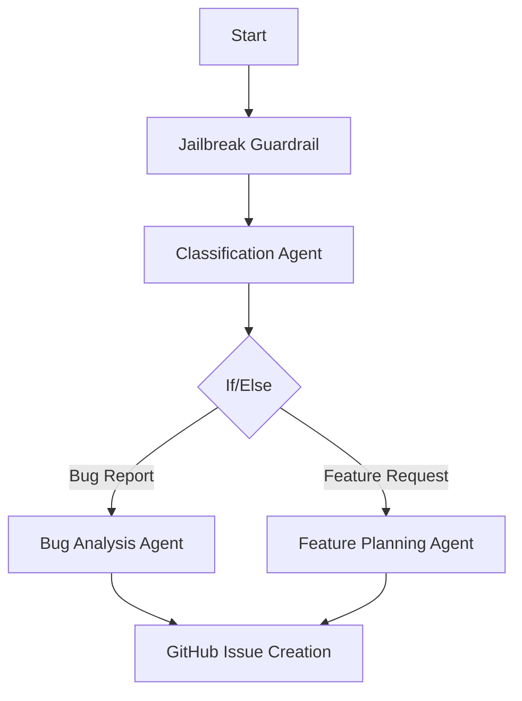

# OpenAI DevDay 2025 완전 분석 리포트
## 2025년 10월 6일 발표 내용 상세 해부

### 📅 발표 개요
- **일시**: 2025년 10월 6일 (오늘 기준 10일 전)
- **장소**: Fort Mason, 샌프란시스코
- **발표자**: Sam Altman (CEO) 외
- **핵심 테마**: "AI가 AI를 만드는 시대" - Agent 중심 개발 생태계 완성

---

## 🎯 메가 트렌드: 6대 핵심 발표

### 1️⃣ **Codex - AI 페어 프로그래머 (일반 제공)**

#### **🔥 혁신 포인트**
전체 코드베이스를 읽고 작성·테스트·PR 리뷰까지 수행하는 완전체 에이전트

#### **사용 방식 3가지**
```bash
# 1. 터미널에서 직접 사용
npm install -g @openai/codex
codex "사용자 인증 기능 추가해줘"

# 2. IDE 통합 (VS Code, Cursor, Windsurf)
# 확장 프로그램 설치 후 자동 작업

# 3. 클라우드 백그라운드 위임
# Codex Cloud에서 격리된 환경에서 feature 완전 구현
```

#### **Slack 완전 통합**
```
팀원: @Codex 결제 시스템에 Stripe 연동해줘
Codex: 환경 생성 중... → 코드 작성 → 테스트 완료 
       리뷰 링크: github.com/repo/pr/123
```

#### **실제 성과 (내부 데이터)**
- **OpenAI 내부**: PR 처리량 70% 증대
- **Cisco**: 코드 리뷰 시간 50% 감소
- **사용률**: OpenAI 엔지니어 대부분이 일상 업무에 활용

#### **Codex SDK 예시**
```typescript
// 내부 워크플로우에 에이전트 임베드
import { CodexSDK } from '@openai/codex-sdk';

const codex = new CodexSDK({
  apiKey: process.env.OPENAI_API_KEY
});

await codex.createTask({
  repository: 'myorg/backend',
  task: '결제 모듈 버그 수정',
  branch: 'feature/payment-fix'
});
```

---

### 2️⃣ **AgentKit - 노코드 멀티에이전트 빌더**

#### **🎨 Agent Builder (핵심 기능)**
**드래그앤드롭으로 복잡한 에이전트 워크플로우 구성**



**실제 구현 속도**:
- **Ramp**: 수개월 → 몇 시간
- **LY Corporation**: 2시간 내 배포 완료

#### **Connector Registry**
**엔터프라이즈 데이터 중앙 관리**
- ✅ Dropbox, Google Drive, SharePoint 사전 연결
- ✅ Microsoft Teams, Slack 직접 통합
- ✅ Global Admin Console을 통한 권한 관리
- ✅ SOC2/GDPR 준수 자동화

#### **ChatKit - 임베드 가능한 채팅 UI**
```javascript
// React 앱에 5분 만에 AI 어시스턴트 추가
import { ChatKit } from '@openai/chatkit-react';

<ChatKit 
  workflowId="workflow_123"
  theme="dark"
  customBranding={{
    primaryColor: "#007bff",
    logo: "/company-logo.png"
  }}
/>
```

**제공 기능**:
- 스트리밍 응답 자동 처리
- 스레드 관리 및 히스토리
- 모델 사고 과정 표시
- 로딩 인디케이터

---

### 3️⃣ **GPT-5 Pro - 차세대 추론 모델**

#### **성능 스펙**
| 지표 | GPT-5 Pro | GPT-4 Turbo |
|------|-----------|-------------|
| **컨텍스트 윈도우** | 400K 토큰 | 128K 토큰 |
| **최대 출력** | 272K 토큰 | 4K 토큰 |
| **추론 능력** | 복잡한 다단계 | 기본 추론 |
| **전문 분야** | 금융, 법률, 의료 | 범용 |

#### **가격 정책**
```
입력: $15 / 1M 토큰 (GPT-4의 3배)
출력: $120 / 1M 토큰 (고품질 추론 비용)

용도: 정밀 분석, 복잡 문제 해결, 전문 자문
```

#### **Responses API 전용**
- 다중 턴 사전 사고(multi-turn reasoning) 지원
- 복잡한 작업을 단계별로 분해하여 처리
- 추론 과정 투명성 제공

---

### 4️⃣ **Sora 2 - 프로덕션급 영상 생성**

#### **2가지 모델 옵션**
```
sora-2: 빠른 실험용 (8초 영상, 낮은 비용)
sora-2-pro: 프로덕션용 (고품질, 긴 영상, 높은 비용)
```

#### **🎬 혁신적 기능들**

**이미지 기반 영상 생성**:
```python
# 캐릭터 일관성 유지
video = openai.videos.create(
    model="sora-2-pro",
    prompt="A detective walking through foggy London streets",
    reference_image="detective_character.jpg",  # 캐릭터 고정
    duration=20,
    resolution="1080p"
)
```

**Remix 기능** (기존 영상 부분 수정):
```python
# 전체 재생성 없이 색상만 변경
remixed_video = openai.videos.remix(
    original_video_id="video_123",
    modifications={
        "color_palette": "warm autumn tones",
        "add_character": "golden retriever dog"
    }
)
```

#### **API 워크플로우**
```python
# 1단계: 영상 생성 요청
response = openai.videos.create(
    model="sora-2",
    prompt="A futuristic city at sunset with flying cars",
    size="1920x1080",
    duration=10
)

# 2단계: 상태 확인 (폴링 또는 웹훅)
video = openai.videos.retrieve(response.id)
while video.status != "completed":
    time.sleep(5)
    video = openai.videos.retrieve(response.id)

# 3단계: 최종 MP4 다운로드
content_url = openai.videos.content(video.id)
```

#### **동기화된 오디오 포함**
- 서라운드 사운드 자동 생성
- 환경음과 배경음악 조화
- 대사와 립싱크 매칭

---

### 5️⃣ **Apps SDK - ChatGPT 내 네이티브 앱 생태계**

#### **🏪 ChatGPT가 App Store가 되다**

**4가지 UI 모드**:
```typescript
// 1. Inline Cards - 대화 중 카드 형태
{
  displayMode: "inline_card",
  title: "호텔 검색 결과",
  content: hotel_search_results
}

// 2. Inline Carousels - 좌우 스와이프
{
  displayMode: "inline_carousel", 
  items: restaurant_list
}

// 3. Fullscreen - 전체 화면 앱
{
  displayMode: "fullscreen",
  component: "MapView"
}

// 4. Picture-in-Picture - 작은 창
{
  displayMode: "pip",
  component: "VideoPlayer"
}
```

#### **Model Context Protocol (MCP) 기반**
```python
# MCP 서버 구현 예시
from mcp import Server

@server.tool("search_flights")
async def search_flights(departure: str, arrival: str, date: str):
    results = await flight_api.search(departure, arrival, date)
    
    return {
        "structuredContent": {
            "flights": results,
            "displayMode": "inline_carousel"
        },
        "content": f"Found {len(results)} flights",
        "_meta": {
            "component": "FlightCard",
            "actions": ["book", "save", "share"]
        }
    }
```

#### **초기 파트너 앱들**
- **Booking.com**: 호텔 검색 및 예약
- **Canva**: 실시간 디자인 생성
- **Spotify**: 플레이리스트 생성 및 재생
- **Figma**: 디자인 협업 및 프로토타입
- **Zillow**: 부동산 검색 및 분석

---

### 6️⃣ **Evals 플랫폼 대폭 업그레이드**

#### **새로운 4대 기능**

**1. 데이터셋 자동 구축**:
```python
# 휴먼 라벨링과 자동 채점 결합
dataset = openai.evals.datasets.create(
    name="customer_support_quality",
    auto_grader="gpt-5-pro",
    human_annotation_rate=0.1  # 10%만 사람이 검토
)
```

**2. Trace Grading (종단간 추적)**:
```python
# 에이전트 워크플로우 전체 성능 분석
trace_result = openai.evals.grade_trace(
    workflow_id="customer_support_agent",
    trace_id="trace_123",
    metrics=["accuracy", "helpfulness", "safety"]
)
```

**3. 자동 프롬프트 최적화**:
```python
# 성능 데이터 기반 프롬프트 개선
optimized_prompt = openai.evals.optimize_prompt(
    current_prompt="You are a helpful assistant...",
    performance_data=eval_results,
    target_improvement="accuracy"
)
```

**4. 서드파티 모델 평가**:
```python
# Claude, Gemini 등 타사 모델도 평가 가능
eval_result = openai.evals.compare_models(
    models=["gpt-5-pro", "claude-3.5", "gemini-2.0"],
    dataset="reasoning_tasks",
    metrics=["accuracy", "speed", "cost"]
)
```

---

## 🛡️ 보안 및 안전성

### **Guardrails - 오픈소스 안전 레이어**

#### **지원 검사 항목**
```python
from openai_guardrails import GuardrailsAsyncOpenAI

client = GuardrailsAsyncOpenAI(
    api_key="your-key",
    guardrails=[
        "prompt_injection",      # 프롬프트 주입 탐지
        "pii_masking",          # 개인정보 마스킹
        "jailbreak_detection",   # 탈출 시도 차단
        "hallucination_check",   # 환각 검출
        "content_moderation",    # 콘텐츠 조절
        "off_topic_filter",      # 주제 이탈 필터
        "url_filtering"          # URL 필터링
    ]
)

# 자동으로 안전성 검사 후 응답
response = await client.chat.completions.create(
    model="gpt-5-pro",
    messages=[{"role": "user", "content": user_input}]
)
```

#### **Python & JavaScript 지원**
```javascript
// Node.js에서 사용
import { GuardrailsOpenAI } from '@openai/guardrails';

const client = new GuardrailsOpenAI({
  apiKey: process.env.OPENAI_API_KEY,
  guardrails: ['pii_masking', 'content_moderation']
});
```

---

## 💰 가격 및 가용성

### **신규 모델 가격표**

| 모델 | 입력 (1M토큰) | 출력 (1M토큰) | 용도 |
|------|-------------|-------------|-----|
| **GPT-5 Pro** | $15 | $120 | 복잡 추론, 전문 분야 |
| **gpt-realtime-mini** | $0.6 | $2.4 | 실시간 음성/텍스트 |
| **gpt-image-1-mini** | - | 이미지당 과금 | 비용 효율적 이미지 생성 |

### **제공 범위**
```
✅ 일반 제공 (GA): Codex, ChatKit, Evals 업그레이드
🔶 베타 제공: Agent Builder, Connector Registry
📅 향후 예정: 독립형 Workflows API, 앱 심사/배포 시스템
```

---

## 📊 실제 성과 및 채택 현황

### **플랫폼 성장 지표**
- **개발자 수**: 2백만 명 (2023) → 4백만 명 (2025)
- **주간 사용자**: 8억 명
- **토큰 처리량**: 분당 60억 토큰 (기존 3억)
- **대형 고객**: 일부는 1조 토큰 처리

### **기업 도입 사례**

#### **Klarna (고객 지원)**
- 지원 에이전트가 전체 티켓의 **2/3 처리**
- 응답 속도 80% 향상
- 고객 만족도 15% 증가

#### **Clay (영업 자동화)**
- 영업 에이전트로 **성장 10배** 달성
- 리드 생성 자동화 95%
- 영업 사이클 50% 단축

#### **Cisco (코드 리뷰)**
- Codex 도입 후 **코드 리뷰 시간 50% 감소**
- 버그 탐지율 30% 향상
- 개발자 생산성 40% 증가

---

## 🚀 즉시 시작하기 가이드

### **1. Codex 설치 (5분)**
```bash
# 전역 설치
npm install -g @openai/codex

# 첫 번째 작업
codex "React에서 사용자 인증 컴포넌트 만들어줘"

# Slack 통합
/codex setup-workspace
```

### **2. Agent Builder 시작하기**
1. [platform.openai.com](https://platform.openai.com) 로그인
2. "Agent Builder" 메뉴 클릭
3. "새 워크플로우" 생성
4. 드래그앤드롭으로 노드 연결
5. "미리보기 실행"으로 테스트

### **3. Sora 2 API 첫 영상**
```python
import openai

# API 키 설정
openai.api_key = "your-api-key"

# 첫 영상 생성
video = openai.videos.create(
    model="sora-2",
    prompt="A cat playing piano in a cozy living room",
    duration=8,
    size="1280x720"
)

print(f"영상 생성 중... ID: {video.id}")
```

### **4. ChatKit 앱에 통합**
```bash
# React 프로젝트에 설치
npm install @openai/chatkit-react

# 5분 만에 AI 어시스턴트 추가
```

---

## 🔮 향후 전망 및 로드맵

### **2025년 Q4 예정 기능**
- **독립형 Workflows API**: Agent Builder 없이도 워크플로우 실행
- **앱 심사/배포 시스템**: ChatGPT App Store 정식 오픈
- **Agentic Commerce**: 앱 내 결제 및 상거래 기능
- **EU 지역 서비스**: 유럽 사용자 대상 앱 제공

### **2026년 예상 발전**
- **GPT-6 미리보기**: 더 강력한 추론 능력
- **멀티모달 에이전트**: 텍스트+이미지+영상+음성 통합
- **하드웨어 통합**: IoT 기기 직접 제어
- **실시간 협업**: 여러 AI 에이전트 동시 작업

---

## 💡 핵심 인사이트

### **패러다임 변화의 본질**
1. **AI가 AI를 만드는 시대**: Codex가 Agent Builder의 80%를 6주 만에 개발
2. **ChatGPT = 새로운 운영체제**: 앱이 대화 속에서 실행되는 환경
3. **노코드 에이전트**: 비개발자도 복잡한 AI 워크플로우 구축
4. **멀티모달 통합**: 텍스트, 이미지, 영상, 음성이 하나로

### **실무 적용 우선순위**
```
1단계 (즉시): Codex로 개발 생산성 향상
2단계 (1개월): Agent Builder로 업무 자동화
3단계 (3개월): 자체 앱 개발하여 ChatGPT 배포  
4단계 (6개월): Sora 2로 마케팅/교육 콘텐츠 제작
```

### **비즈니스 임팩트**
- **개발팀**: 70% 생산성 향상 (Codex)
- **고객지원**: 2/3 자동화 가능 (Klarna 사례)
- **마케팅**: 영상 콘텐츠 제작 비용 90% 절감
- **영업**: 10배 성장 가능 (Clay 사례)

---

## 결론

OpenAI DevDay 2025는 **"AI 개발의 민주화"**를 완성했습니다. 

코드를 모르는 사람도 강력한 AI 에이전트를 만들고, ChatGPT 8억 사용자에게 즉시 배포할 수 있게 되었습니다. Sora 2로 할리우드급 영상을 몇 분 만에 제작하고, Codex로 전체 기능을 대화만으로 구현할 수 있습니다.

**핵심은 "AI가 AI를 만드는 선순환"**입니다. Codex가 Agent Builder를 개발하고, Agent Builder로 더 복잡한 에이전트를 만들고, 그 에이전트들이 또 다른 혁신을 창조하는 생태계가 시작되었습니다.

**지금 당장 시작하세요**: `npm install -g @openai/codex`

미래는 이미 여기에 있습니다. 🚀